<div align="center">



<br/>

<a href="https://portfolio-divi.vercel.app"></a>
&nbsp;
<a href="https://linkedin.com/in/divyansh-gupta-485b04377"></a>
&nbsp;
<a href="mailto:divyanshg2602@gmail.com"></a>
&nbsp;


</div>


## `> contribution_feed`

<div align="center">

<picture>
  <source media="(prefers-color-scheme: dark)" srcset="https://raw.githubusercontent.com/Divyansh2602/github-actions/output/github-contribution-grid-snake-dark.svg" />
  
</picture>

<br/><br/>


</div>


## `> whoami`

```console
divyansh@void:~$ cat /etc/operator
  NAME ......... Divyansh Gupta
  ROLE ......... Security Engineer · Full-Stack Developer · Blockchain Auditor
  BASE ......... CS @ VIT — class of 2027
  RECORD ....... Backend @ XtraGrad · Smart-contract auditing @ IBM · Frontend @ 1Stop.ai
  HONOURS ...... Hack Energy 2.0 Finalist · PSB Hackathon 2026 (UCO Bank × IIT KGP)
  DOCTRINE ..... assume hostile input · least privilege · leave an audit trail
  MISSION ...... build the systems, then break them before anyone else can
```

- 🔭 I build **end-to-end platforms that assume hostile input** — validated UIs, modular Python backends, and offensive tooling that maps attack surface
- ⛓️ Audited **Ethereum smart contracts at IBM** — reentrancy, access control, gas-misuse
- 🕸️ I understand **how apps are built *and* how they break**


## `> arsenal --list`

<div align="center">


</div>

| module | payload |
|---|---|
| 🎯 **Offensive security** | Web-app pentesting · attack-surface mapping · recon & exploit automation · API/parameter fuzzing |
| 🛡️ **Defensive doctrine** | OWASP Top 10 · threat modeling · strict input validation · secure-by-design reviews |
| ⛓️ **Blockchain security** | Solidity auditing · reentrancy / access-control / gas-misuse detection · AST static analysis |
| 🧠 **AI & data** | ML pipelines (scikit-learn, pandas) · LLM integrations · web crawling · ElasticSearch |


## `> declassified_projects --clearance=public`

<details open>
<summary>🟢 <b>CASE FILE 01 — CivicShield</b> · AI threat-intelligence platform <i>(Hack Energy 2.0 Finalist)</i></summary>
<br/>

> **Mission brief:** real-time global threat dashboard — live DDoS/ransomware/phishing feeds on a 3D globe, auto-classified severity, vulnerability scanner, attack-surface mapper, and AI-driven scan intelligence.
>
> **Stack:** `Python` `JavaScript` `AI/ML` `REST APIs` `3D Visualisation`
> **Deploy:** [🌐 live](https://civicshieldx.vercel.app/) · [📁 source](https://github.com/Divyansh2602/CivicShield_full)

<a href="https://github.com/Divyansh2602/CivicShield_full"></a>

</details>

<details>
<summary>🟣 <b>CASE FILE 02 — CipherMind</b> · end-to-end encrypted AI chat</summary>
<br/>

> **Mission brief:** every message is AES-256-GCM ciphered *before leaving the browser* — zero plaintext in transit. PBKDF2 session keys, HMAC-SHA512 integrity, Groq Llama 3.3 70B backend with the API key fully server-side.
>
> **Stack:** `React` `TypeScript` `AES-256-GCM` `PBKDF2` `HMAC-SHA512` `Groq API`
> **Deploy:** [🌐 live](https://ciphermind-frontend.vercel.app/) · [📁 source](https://github.com/Divyansh2602/ciphermind)

<a href="https://github.com/Divyansh2602/ciphermind"></a>

</details>

<details>
<summary>🟠 <b>CASE FILE 03 — ChainAudit</b> · automated Solidity security auditor</summary>
<br/>

> **Mission brief:** static-analysis engine that parses Solidity, extracts the AST, and hunts reentrancy, overflow, unchecked calls, broken access control, and gas-griefing — then ships structured audit reports with Critical→Low severity and remediation guidance.
>
> **Stack:** `Solidity` `JavaScript` `AST Analysis` `Web3` `Ethereum`
> **Deploy:** [🌐 live](https://chainaudit.vercel.app/) · [📁 source](https://github.com/Divyansh2602/smart-contract-auditor)

<a href="https://github.com/Divyansh2602/smart-contract-auditor"></a>

</details>

<details>
<summary>🔴 <b>CASE FILE 04 — SecureScout</b> · enterprise security scanner <i>(PSB Hackathon 2026 — UCO Bank × IIT KGP)</i></summary>
<br/>

> **Mission brief:** production-grade scanner for banking systems — vulnerable dependencies, hardcoded secrets, weak crypto, injection flaws. Next.js dashboard with 5-tier RBAC, immutable audit logging, and a CI/CD gate that fails the pipeline on Critical findings.
>
> **Stack:** `Python` `TypeScript` `Next.js` `Express` `PostgreSQL` `Redis`
> **Deploy:** [🌐 live](https://securescout-web.vercel.app/) · [📁 source](https://github.com/Divyansh2602/securescout-)

<a href="https://github.com/Divyansh2602/securescout-"></a>

</details>

<details>
<summary>🕷️ <b>CASE FILE 05 — Attack Surface Analyzer</b> · offensive web recon engine</summary>
<br/>

> **Mission brief:** crawls targets, extracts endpoints & parameters, flags SQLi / XSS / IDOR candidates, and generates professional pentest reports — recon to report, fully automated.
>
> **Stack:** `Python` `Requests` `BeautifulSoup` `Regex` `Automation`
> **Deploy:** [📁 source](https://github.com/Divyansh2602/attack-surface-analyzer)

<a href="https://github.com/Divyansh2602/attack-surface-analyzer"></a>

</details>

<details>
<summary>🟡 <b>CASE FILE 06 — Accident Risk Model</b> · ML severity & blackspot prediction</summary>
<br/>

> **Mission brief:** end-to-end ML pipeline predicting 2026 road-accident severity and geographic blackspots — EDA, multi-factor feature engineering (time, weather, road, vehicle), and interpretable risk-tier scoring.
>
> **Stack:** `Python` `scikit-learn` `pandas` `EDA` `Feature Engineering`
> **Deploy:** [📁 source](https://github.com/Divyansh2602/2026_accident_model)

<a href="https://github.com/Divyansh2602/2026_accident_model"></a>

</details>


## `> telemetry --live`

<div align="center">


<br/><br/>


<br/><br/>


<br/><br/>


</div>


## `> transmission --open-channel`

<div align="center">

**Found a vulnerability in my profile? Report it over coffee. ☕**

<a href="mailto:divyanshg2602@gmail.com"></a>
<a href="https://linkedin.com/in/divyansh-gupta-485b04377"></a>
<a href="https://portfolio-divi.vercel.app"></a>

<br/>

```
"To break an application, you must first know how to build it."
```

 transmission ends" />

</div>
